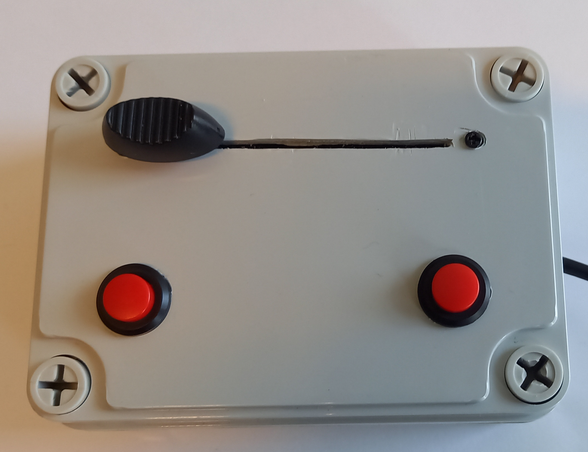

# Button box

In our experimental protocols we often ask participants to give a binary answer (yes/no, old/new) and to report how confident they are in their answer.

In Unity we used to rely on a keyboard and/or mouse for this.
Unfortunately, this can be slow and needlessly complicated when working with persons that are tired, depressed, old, etc.

So I made a very simple button box.
It has two buttons and a slider. It is controlled by a Arduino Nano that simply samples the state of the buttons (boolean) and the position of the slider (2^10 a2d read).

